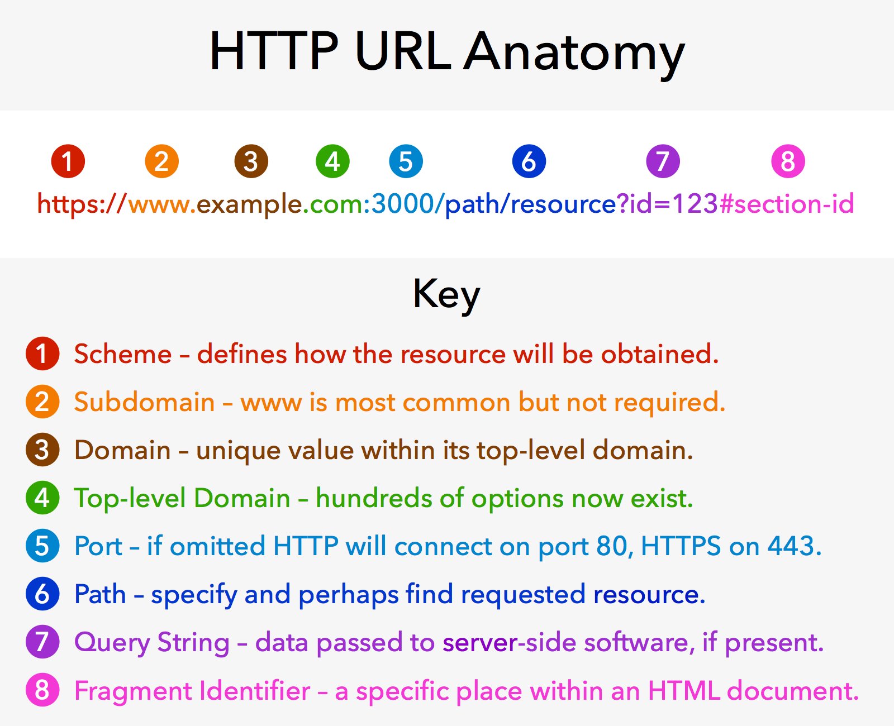
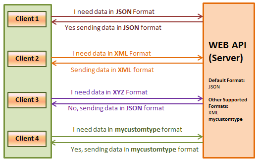

# HTTP
웹브라우저와 웹서버간의 통신을 위해 개발된 통신규약   
REST API의 부상과 함께 다른 용도로도 널리 사용됨  
- 모바일앱 - 서버간 통신
- 서버 - 서버 간 통신

80번 포트를 기본으로 사용  
클라이언트의 <b>요청</b>과 서버의 <b>응답</b>으로 이루어짐  
# HTTPS
- HTTP ovse SSL의 약자

SSL은 보안의 약자이다.  
HTTP 통신을 암호화해 주고받는 내용을 중간에서 가로 챌 수 없게함  
443번 포트를 기본으로 사용함.  

# HTTP/2
- 구글의 SPDY 프로토콜을 기반으로 <b>2015년에 확정</b>된 새로운 HTTP 표준  
- 속도 개선에 중점을 두고 개발됨
- 반드시 HTTPS를 사용해야 함
- 현재 전체 웹사이트 중 16%이상이 사용중이다.  

# HTTP 구성요소
## 요청 & 응답
- 웹 브라우저는 웹 서버에 요청을 보냄  
- 서버는 클라이언트에 응담을 보냄
- 웹브라우저의 경우 HTML 문서 형태의 응답이 오면 해당 문서를 분석 후 문서에 포함된 모든 자원에 대한 요청을 각각 추가로 보냄(이미지, 동영상, CSS, JS, font등 각각 요청을 분석하면서 요청함.)

## Request & Response
- HTTP 명세에는 8 종류가 등록되어 있고, 각각의 역할과 충족해야 하는 성질이 명시되어 있음(GET, HEAD, POST, PUT, DELETE, CONNECT, OPTIONS, PATCH)
- 웹브라우저는 특정 상황에서 특정 메소드로 요청을 보내도록 만들어져 있음.  
- Ajax와 같이 요청을 보내는 코드를 직접 짤 때는 요청 메소드를 선택 할 수 있음  
- 자료의 본문을 요청하는 GET 메소드와 새로운 자료를 등록하는 POST를 가장 많이 사용하고 있음  

## 메소드의 성질
Safe  
- 요청이 서버의 상태에 영향을 미치지 않아야함.(읽기전용)

Idempotent
- 여러번 같은 요청을 해도 한 번 요청한 것과 같은 효과여야 함.(네트워크가 불안정해서 여러번 요청을 보낼 수 있음)
- GET, DELETE, PUT 메소드는 Idempotent가 가능해야한다.  
- POST, PATCH는 Idempotent로 작동되어서는 안된다.

Cacheable
- (특정 조건을 만족하면) 응답을 클라이언트에 저장해두었다가 다음 번 요청 때 다시 쓸 수 있음.

# URL
URL은 웹 주소만 의미하는 것은 아니다.  

2,3,4,5번은 서버의 위치를 의미한다.  
6번은 서버 내 위치를 의미한다.  
7번은 ?뒤에 쿼리문을 의미한다.  
8번은 한국에선 해쉬라고 한다.  

## Percent Encoding
- URL은 ASCII 문자(128개의 영문자+특수문자+제어문자)밖에 사용하지 못하기 때문에, non-ASCII 문자를 위한 표현방법이 필요함  
- 웹 표준에 들어있는 변환방식이다.  
- Percent encoding은 non-ASCII 문자를 위한 웹 표준 인코딩 방법으로, JavaScript에 관련 기능이 포함되어 있음

## Request Target
보통의 경우 다음과 같은 경로를 구성하고 있음(absolute path + query string + fragment id)
```
GET /path/to/resource?foo=bar&spam=hoge#fragid HTTP/1.1
```

## Response Status
응답의 성공, 실패 여부와 종류를 나타내며, 상태 코드 + 상태 메세지의 형태로 응답에 포함됨
```
HTTP/1.1 200 OK
```

## Status Category
[HTTP status code list](https://httpstatuses.com/)  
2xx
- 성공

3xx
- 추가 작업이 필요함
- 요청을 잘 했지만 추가적으로 실행해야 함을 알려줌

4xx
- 실패 - 클라이언트 책임

5xx
- 실패 - 서버 책임

### Status Code - 2xx
201 Created
- post 시 자료 생성이 완료되었다고 알려주는 코드

### Status Code - 3xx
301 Moved Permanently (Redirection)
- 자료가 완전히 다른 곳으로 이동했음

302 Found (Redirection)
- 자료가 일시적으로 다른 곳에 있음
- 301과 비슷해 보이지만 301과의 브라우저 동작은 완전히 다름

304 Not Modified (Cache)
- 클라이언트가 이미 가지고 있던 자료가 수정되지 않았음 (그대로 사용하면 됨)

### Status Code - 4xx
400 Bad Request
- 요청의 형태가 잘못되어 응답할 수 없음
- REST API를 사용 시 잘못된 요청을 할 때 에러가 표출되기도 함.

403 Forbidden
- 요청한 자료에 접근할 권한이 없음

404 Not Found
- 요청한 자료가 없음

### Status Code - 5xx
500 Internal Server Error
- 요청을 처리하던 중에 예상치 못한 오류가 발생함
- try catch로 에러를 캐치했을때 표출해주는 경우가 있음

503 Service Unavailable
- 서버가 일시적으로 응답을 할 수 없음
- 서버의 traffic이 몰렸을 때 표출 함

## Header
- 요청과 응답에 대한 추가 정보를 표현하는 데 사용됨  
- 웹 표준에 정의된 많은 기능을 제어하는 데 사용됨  

Authorization
- 요청의 인증 정보

User-Agent
- 요청 중인 클라이언트의 정보
- 어떤 브라우저를 사용하는지에 대한 정보도 갖고 있음

Location
- 301, 302 응답에서 반드시 Location헤더가 포함되어 있음

Accept
- 요청이 어떤 형태의 자료를 원하는지 나타냄

Content-Type
- 요청 혹은 응답이 어떤 형태의 자료인지 나타냄

## Content Negotiation

요청의 Accept, Accept-Language 등의 헤더를 보고 서버가 그에 맞는 형태의 자료를 응답하는 절차를 content negotiation(내용협상)이라고 함

- - -
# Express
Node.js 생태계에서 가장 널리 쓰이는 웹 프레임워크  
내장하고 있는 기능은 매우 적으나 쉬운 확장성을 갖고 있음  

## Glitch
Glitch는 웹 브라우저 위에서 Node.js 기반 앱을 만들고, 복제하고, 편집하고, 공동 작업하고, 호스팅할 수 있는 환경을 제공합니다.  
codepen과 비슷한 웹상에서 코드를 작성 할 수 있는 웹브라우저 환경이다.  
Node.js server에서 수정이 되면 서버를 재시작해줘야 하지만 글리치페이지는 자동으로 서버를 재시작해준다.  

## Routing
라우팅메소드의 첫번째 요소는 요청객체 두번째 요소는 응답객체를 갖고 있다.  
요청은 req 응답은 res로 약어를 사용하는게 관례이다.  
```js
app.post('/articles', bodyParserMiddleware(), (req, res) => {
  database.articles.create(req.body)
    .then(() => {
      res.send({ok: true})
    })
})
```
특정 경로에만 미들웨어를 사용 가능하다.  
`bodyParserMiddleware()`가 있는 곳에 미들웨어를 넣으면 된다.  
응답을 html로 보내고 싶으면 문자열을 입력하면 되고 JSON으로 보낼수도 있다.  

## Request 객체
req.body
- 요청 바디를 적절한 형태의 자바스크립트 객체로 변환하여 이곳에 저장 (body-parser 미들웨어에 의해 처리됨)
- 익스프레스에 많은 기능이 있다면 느려지기 때문에 미들웨어 형식으로 가볍게 사용 할 수 있도록 바뀜

req.ip
- 요청한 쪽의 IP

req.params
- route parameter

req.query
- query string이 객체로 저장됨

res.status(...)
- http의 상태 코드를 지정 할 수 있음
- 응답의 상태 코드를 지정하는 메소드

res.append(...)
- 응답의 헤더를 지정하는 메소드

res.send(...)
- 응답의 바디를 지정하는 메소드 
- 인자가 텍스트면 text/html, 객체면 application/json 타입으로 응답

res.render(파일이름, data)
- 파일이름과 템플릿안에 담을 데이터를 넘겨준다.

# Template Language
Static Web Page
- 누가 어떻게 요청하든 미리 저장되어 있던 HTML 파일을 그대로 응답

Dynamic Web Page
- 요청한 사람과 요청한 내용에 따라 **각각 다른 내용으로 편집한 HTML을 응답**
- 조금씩 편집을 하여 다르게 표현을 해줌

## 웹 초창기 - CGI
```c#
int main(void)
{
  char *data;
  long m,n;
  printf("%s%c%c\n", "Content-Type:text/html",13,10);
  printf("<TITLE>Multiplication results</TITLE>\n");
  printf("<H3>Multiplication results</H3>\n");
  data = getenv("QUERY_STRING");
  if(data == NULL)
    printf("<P> Error in passing data from form to script.");
  else if(sscanf(data,"m=%ld&n=%ld",&m,&n)!=2)
    printf("<P>Error! Invalid data. Data must be numeric.");
  else
    printf("<P>The product of %ld and %ld is %ld.",m,n,m*n);
  return 0;
}
```

## Template Engine
- 템플릿과 데이터를 결합해 문서를 생성하는 프로그램, 혹은 라이브러리
- 템플릿을 작성할 때 사용하는 언어를 템플릿 언어라고 함

### EJS(Embedded JavaScript Template)
- Node.js 생태계에서 가장 많이 사용되는 템플릿 엔진
- 문법이 단순
- JavaScript 코드를 템플릿 안에서 그대로 쓸 수 있음  
- EJS의 주석은 파싱 시 삭제가 된다.
## 템플릿 태그
- <% ... %>: 템플릿의 구조를 제어하기 위해 사용하며, 문자열을 내놓지 않습니다.
- <%= ... %>: 내부의 식을 문자열로 변환해 HTML 문서 안에 삽입합니다.
- <%# ... %>: EJS 주석입니다. HTML 주석과는 다르게 아예 HTML 문서에 포함되지 않습니다.
```js
    <% if (showSecret) { %>
      <div>my secret</div>
    <% } %>
```
javascript처럼 if문을 사용 가능하다.  

### Pug
닫는태그가 없다.  
들여쓰기로 코드를 작성한다.(코딩 방식을 강제한다.)
다른 탬플릿 파일을 불러와 저장 할 수 있다.  