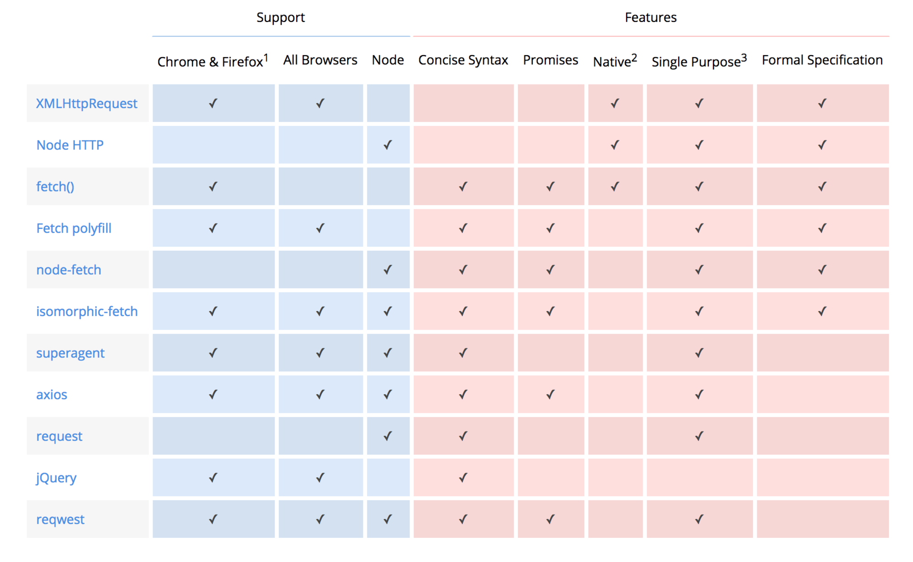
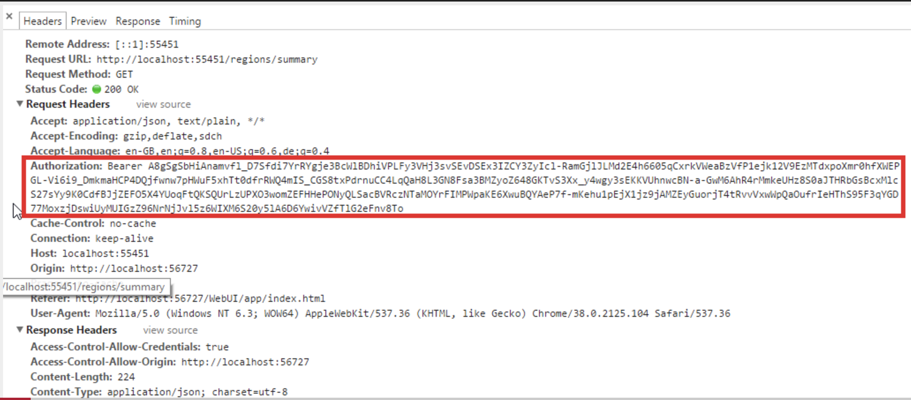
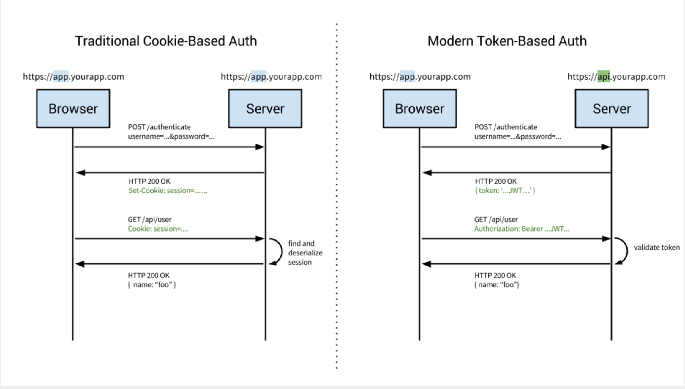

# Ajax
비동기적(새로고침을 없앤)인 웹 어플리케이션의 제작을 위한 클라이언트 측 웹 개발 기법  
요즘은 웹 브라우저에서 XMLHttpRequest 혹은 fetch를 이용해서 보내는 HTTP 요청을 통칭하기도 함  


## Ajax의 장점
- 페이지를 다시 로드하지 않고도 내용을 갱신 할 수 있어 더 나은 사용자 경험 제공
- 서버의 응답을 기다리는 동안에도 여전히 웹 어플리케이션을 사용 가능
- 필요한 자원만 서버에서 받아오게 되므로 트래픽이 줄어듬

## Ajax의 단점
- 클라이언트 구현이 굉장히 복잡해짐

## Ajax Library Comparison


## Axios
- Promise based HTTP client
- 브라우저와 Node.js에서 모두 사용 가능
- XMLHttpRequest, fetch에 비해 사용하기 편하고 기능이 더 많음(fetch는 작동 도중에 취소가 불가능 함.)

### HTTP method
- GET(자료 읽기)  
- POST(자료 생성)  
- PUT(치환) & PATCH(갱신)
- DELETE(삭제)
- HEAD OPTION
- TRACE CONNECT

주로 GET POST PUT DELETE를 사용한다.

## json-server
```js
const jsonServer = require('json-server')
const fs = require('fs')

const server = jsonServer.create()
const router = jsonServer.router('.data/db.json')
const middlewares = jsonServer.defaults({noCors: true})
 
server.use(middlewares)
server.use('/api', router)
server.listen(3000, () => {
  console.log('JSON Server is running')
})
```

GET: data만 받아옴.  
```js
// GET
axios.get('/api/todos')
  .then(res => {
    prettyPrint(res.data)
  })
```
POST: data를 뒤에 붙여서 요청을 보낼 수 있다.  
```js
// POST
axios.post('/api/todos', {title: "ajax 공부"})
  .then(res => {
    prettyPrint(res.data)
  })
```
PATCH: data를 덮어씌우기 할 수 있다.  
PATCH에서 ,뒤에 데이터를 붙일 수 있다.
```js
// PATCH
axios.patch('/api/todos/3', {title: "axios 공부"})
  .then(res => {
    prettyPrint(res.data)
  })
```
DELETE: data를 삭제함.  
```js
// DELETE
axios.delete('/api/todos/3')
  .then(res => {
    prettyPrint(res.data)
  })
```

## GET 방식의 timeout 후 에러 처리
```js
// config 객체
axios.get('/api/todos', {
  params: { // query string
    title: 'react 공부'
  },
  headers: { // 요청 헤더
    'X-Api-Key': 'my-api-key'
  },
  timeout: 1000 // 1초 이내에 응답이 오지 않으면 에러로 간주
}).then(res => {
    prettyPrint(res.data)
  })
```
then 뒤에 catch와 arrow function을 이용하여 에러를 표출 할 수 있다.  

### 응답 객체
```js
// config.params
axios.get('/api/todos/1')
  .then(res => {
    console.log(`status code: ${res.status}`)
    console.log('headers:')
    prettyPrint(res.headers)
    console.log('data:')
    prettyPrint(res.data)
  })
```
데이터를 받아 올 때 다양한 상태코드 등 여러 정보에 접근 할 수 있다.

```js
const username = req.body.username
const password = req.body.password
```
위 코드를 `const {username, password} = req.body`과 같이 한줄로 사용 가능하다.  

에러 처리에서 가장 많이 사용되는 방법  
rander / redirect / send / end  
팀 프로젝트에서 에러처리를 어떻게 해야할지 고민하여 처리방법을 선택해야한다.  

로그인은 POST 로그아웃은 DELETE를 이용하여 구현하고 있다.  


- - -
## Same-origin Policy(동일 출처 정책)  
- 웹 보안은 기본적으로 동일 출처 정책을 실시한다.  
- 웹페이지에서 리소스를 불러올 때, 리소스의 출처가 웹페이지의 출처와 같으면 안전하다고 보고, 출처가 다르면 안전하지 않다고 보는 원칙
- 여기서 `'출처'`란 `'프로토콜 + 도메인 + 포트번호'`의 결합을 가리킴. 즉, 세 개가 다 같아야 동일 출처라고 할 수 있고, 셋 중에 하나라도 다르면 동일 출처로 간주되지 않음

## Content-Security-Policy
- Content-Security-Policy 헤더를 이용하면, 동일하지 않은 출처에 대한 리소스를 불러올지 말지 결정할 수 있음
- [콘텐츠 보안 정책](https://developers.google.com/web/fundamentals/security/csp/?hl=ko)

# CORS(Cross-Origin Resource Sharing)
- 클라이언트 측 cross-origin 요청을 안전하게 보낼 수 있는 방법을 정한 표준
- 쉽게 말하면, 스크립트가 전혀 다른 출처를 갖는 API 서버를 사용하려고 하는 상황에서는 뭔가 추가적인 처리를 해주어야 한다는 것!

## Cross-origin 요청의 위험성

## CORS에 관여하는 응답 헤더
- Access-Control-Allow-Origin
- Access-Control-Expose-Headers
- Access-Control-Max-Age
- Access-Control-Allow-Credentials
  - cross-origin 요청에는 기본적으로 쿠키가 포함되지 않으나, XMLHttpRequest 혹은 fetch를 통해서 요청을 보낼 때 쿠키를 포함시키는 옵션을 줄 수 있고 이 때 CORS 요건이 더 엄격해짐
- Access-Control-Allow-Methods
- Access-Control-Allow-Headers

## CORS에 관여하는 요청 헤더
- Origin
- Access-Control-Request-Method (preflighted 전용)
- Access-Control-Request-Headers (preflighted 전용)

## CORS safe, unsafe
POST, PUT, PATCH, DELETE 등의 메소드는 요청이 서버에 전송되는 것 자체가 위험하므로, 실제 요청을 보내기 전에 서버가 cross-origin 요청을 허용하는지를 알아보기 위해 시험적으로 요청을 한 번 보내본다. 이 요청을 **preflighted request**라고 한다.

- - -
# Access Token & JWT

## 쿠키의 단점
- 쿠키를 지원하는 클라이언트에서밖에 사용할 수 없음
- 모바일에서 쿠키를 사용하게 되면 웹브라우저를 하나 두어야한다.  
- 적절히 관리되지 않은 쿠키는 보안에 취약하며, 관리를 하려고 해도 CORS 대응이 복잡함
- 쿠키를 포함하기를 원하지 않아도 쿠키가 전송 될 수 있다.  

## Token Based Auth
- 토큰이란, 사용자의 자격증명(아이디, 패스워드 등)을 통해 인증이 이루어진 후, 특정 자원에 대한 자격증명으로서 대신 사용되는 인증 수단
- 서버에 요청을 할 때마다 토큰을 요청에 직접 포함시켜서 전송 (주로 Authorization 헤더에 넣어서 전송)


Bearer뒤에 토큰형식으로 전송된다.

## Cookie vs Token
 
쿠키는 쿠키를 서로 전송을 함.
토큰은 클라이언트 측 자바스크립트 자체가 토큰을 저장, 전송을 함.  
웹서비스와 모바일 앱까지 한번에 사용을 하는 서비스가 있다면 서버와 브라우저의 주소가 다르게 구현하기 때문에 주소를 다르게 팀프로젝트를 진행하는 것을 추천한다.  

## 토큰 사용의 장점
- 다양한 인증 수단(전화번호, 공인인증서, 생체정보 등)의 인증 결과를 토큰이라는 하나의 수단으로 통일할 수 있음
- 쿠키를 사용하지 않음으로써 **CORS 관련 문제를 회피**할 수 있음

## 토큰 사용의 단점
- 매 요청에 토큰이 포함되게 되므로 적당히 짧은 길이를 유지해야 함(주의점)
- 토큰 유출에 대한 대비책이 필요 (토큰에 유효기간을 두거나, 유출된 토큰을 강제로 무효화하는 등의 방법을 사용)
- 쿠키와는 다르게, 클라이언트에서 직접 토큰을 저장하고 관리해야 함

## Web Storage
- 브라우저에서 키-값 쌍을 저장할 수 있는 저장소
- 쿠키에 비해 사용하기 편리하고 저장 가능한 용량도 큼(10MB 가량)
- 브라우저 탭이 닫히면 내용이 삭제되는 sessionStorage, 브라우저 탭이 닫혀도 내용이 유지되는 localStrage가 있음

## 보안 상 주의사항
- 토큰을 localStorage에 저장하게 되면 자바스크립트로 토큰을 탈취할 수 있게 되므로, 웹사이트에 악성 스크립트를 삽입하는 공격(XSS)에 노출되지 않도록 신경써야 함
- 직접 DOM API를 사용하는 대신 EJS, React 같은 템플릿 언어를 사용하기만 해도 XSS에 대한 방어는 충분함
- 실무에서는 DOM API에 **innerHTML**을 직접 사용해서는 안된다.

## JWT(JSON Web Token)
[JWT](https://jwt.io/)
- 최근 널리 사용되고 있는 토큰 형식의 표준
- 토큰 안에 **JSON 형식**으로 정보를 저장함
- 보안을 위해 서명 또는 암호화를 사용할 수 있음 (선택)

- - -
# Fetch API
- 웹 브라우저의 XMLHttpRequest를 대체하기 위해 만들어진 새로운 HTTP client 표준
- 비교적 최근에 도입되어 IE 및 구형 안드로이드 브라우저(4.x)는 지원하지 않음
- [Fetch Polyfill](https://github.com/github/fetch)
- [isomorphic-fetch](https://www.npmjs.com/package/isomorphic-fetch)

## Axios vs Fetch API
- Instance와 같이 설정을 재사용하거나 요청중인 연결을 취소하는 등의 편의기능이 Fetch API에는 없음
- 현재는 편의기능이 없기때문에 Axios를 사용하는 것을 추천한다.  
- 다만, Axios는 내부적으로 XMLHttpRequest를 사용하고 있는데 **Service Worker 등의 웹 최신 기술이 XMLHttpRequest를 지원하지 않으므로**, Service Worker를 사용할 예정에 있는 프로젝트에서는 Axios를 사용할 수 없음