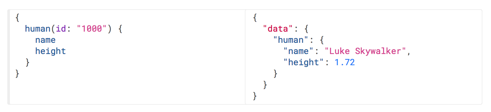

# HTTP Cache

## Cache
- 컴퓨터 분야에서의 캐시는 (주로 접근 속도의 개선을 위해) 데이터를 미리 복사해 놓는 임시 저장소, 혹은 그 임시 저장소에 데이터를 저장하는 행위를 가리킴
- 'cache' 혹은 'caching'이라는 용어 자체는 특정 기술을 가리키는 것이 아니라, 접근 속도를 개선하기 위해 따로 저장소를 두는 '방법'을 가리킴
- 컴퓨터의 아주 많은 부분(CPU, GPU, HDD, 네트워크, 웹, 데이터베이스...)에서 사용되고 있음
- 캐쉬라는 말은 범용으로 사용하고 있다.  

## HTTP Cache
- 자원의 효율적 로딩을 위한 웹 표준
- 서버에서 가져온 자원(HTML, CSS, JS, 이미지, ...)을 가까운 곳(브라우저, 혹은 다른 서버)에 저장해놓고 재사용
- 캐시를 할 것인지 말 것인지, 어떻게 할 것인지를 결정하는 규칙이 복잡하고, 브라우저마다 조금씩 다름(브라우저 별로 캐시를 사용하는 양이 다름)

## Common Problem
캐시된 자원과 실제 자원의 내용이 달라지는 문제를 
어떻게 해결할 것인가?

## Solution(대부분의 해결 방법)
Expiration (만료)
- 정해진 시간이 지나면 캐시가 자동으로 삭제되도록 설정
- 속도가 중요할 때 사용

Validation (검증)
- 서버에 요청을 보내서 캐시를 계속 사용할 수 있는지 확인
- 보안이 중요 할 때 사용

## Cache 관련 헤더
- [Cache 범주](https://developer.mozilla.org/ko/docs/Web/HTTP/Headers#Caching)
- [Conditionals 범주](https://developer.mozilla.org/ko/docs/Web/HTTP/Headers#Conditionals)

### 자주사용하는 Cache 헤더
Cache-Control
- (요청, 응답) 캐시와 관련된 다양한 기능을 하는 지시자를 포함. no-cache, max-age가 많이 사용됨. no-cache, max-age=0 지시자는 캐시를 사용하지 않도록 하거나, 캐시를 아직도 쓸 수 있는지 검증하기 위해 사용됨

ETag (ex. todo의 ID)
- (응답) 캐시의 검증을 위해 사용되는 자원의 식별자. 주로 자원의 [해시값](https://namu.wiki/w/%ED%95%B4%EC%8B%9C)이 사용되나, 마지막으로 수정된 시각, 혹은 버전 넘버를 사용하기도 함

Expires
- (응답) 캐시를 만료시킬 시각을 서버에서 명시적으로 지정

Last-Modified
- (응답) 원래 자료가 마지막으로 수정된 시각

If-None-Match
- (요청) 검증을 위해 사용됨. 이전에 저장해두었던 자원의 ETag 값을 If-None-Match 헤더의 값으로 요청에 포함시켜서 보내면, 서버는 해당 경로에 있는 자원의 ETag와 비교해보고 자원의 전송 여부를 결정
- ETag값과 If-None-Match값이 같으면 데이터는 변경되지 않음을 알 수 있음.

If-Modified-Since
- (요청) 검증을 위해 사용됨. 이전에 저장해두었던 자원의 Last-Modified 값을 If-Modified-Since 헤더의 값으로 요청에 포함시켜서 보내면, 서버는 해당 경로에 있는 자원의 Last-Modified와 비교해보고 자원의 전송 여부를 결정

POST PATCH PUT DELETE는 응답을 304로 보내지 않는다.  
위 4가지 요청은 data를 변경하기 때문에 캐쉬되지 않는다.  
commend+shift+R을 누르면 캐쉬가 삭제 후 재다운로드 된다.  

## Cacheable Method

## 캐시의 사용
원하는대로 캐시가 동작하지 않을 때 그 원인을 파악하기 위해 캐시 관련 헤더는 숙지해두는 것이 좋다.  
HTTP method를 용도에 맞게 사용하는 것도 중요합니다.  
GET메소드를 사용하여 삭제, 개정, 추가를 하게 될 경우 캐시가 변경이 되지 않을 수 있다.  
- 브라우저는 이미 캐시를 잘 활용하도록 만들어져 있습니다.
- Express는 이미 캐시를 잘 활용하도록 만들어져 있습니다.

- - -
# GraphQL

## REST API의 단점 (자원이 URL로 표현됨)
- 각각의 자원마다 경로가 따로 있음. 즉, 여러 자원이 동시에 필요한 경우에는 요청을 여러 번 보내야 함 (요청의 횟수 면에서 비효율적)
- (보통의 경우) 자원의 필요한 속성만 얻어올 수 없음. 즉, 일부 속성의 필요하더라도 전체 속성을 가져와야만 함 (응답의 용량 면에서 비효율적)

## GraphQL
- Facebook에서 2015년 공개한 데이터 질의 언어
- REST API를 대체하기 위해 만들어짐
- 클라이언트에서 필요한 데이터의 구조를 GraphQL 언어로 정의한 후 질의할 수 있고, 서버는 그에 맞게 구조화된 데이터를 응답
- 서버에서는 GraphQL 질의를 해석하기 위해 별도의 해석기가 필요하며, 여러 언어의 구현체가 나와있는 상태
- 다양한 언어를 사용하여 서버를 개발하더라도 GraphQL을 사용을 할 수 있을 정도로 성숙이 되어있다.  

## Example

- - -
# Single Page Application
## SPA의 구조
